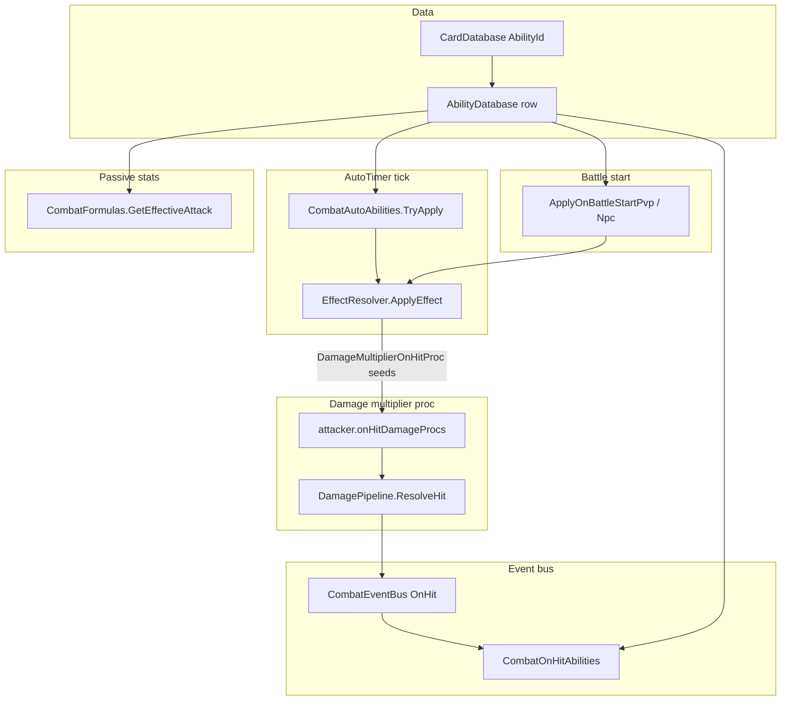

# Ability System (Data-Driven Guide)

This repo maps **cards → `AbilityId`** in [`CardDatabase.luau`](../src/shared/CardDatabase.luau), with **canonical definitions** in [`AbilityDatabase.luau`](../src/shared/AbilityDatabase.luau). Runtime lookup uses [`CardAbilityConfig.luau`](../src/shared/CardAbilityConfig.luau) (`GetAbility`).

**Use this doc when adding abilities:** pick a **Trigger** first (section 3), then find the right **module** (section 2) and **EffectType** (sections 4–5).

---

## 0) Quick reference (for implementation)

| Goal | Trigger | Where to implement | Typical `EffectType` |
|------|---------|--------------------|----------------------|
| Periodic cast (cooldown tick) | `AutoTimer` | `CombatAutoAbilities.TryApply` → `EffectResolver` | e.g. `TeamAttackDamageBoost` |
| Once at battle start | `OnEntry` | `ApplyOnBattleStartPvp` / `ApplyOnBattleStartNpc` → `EffectResolver` | e.g. `StunOneEnemy`, `DamageMultiplierOnHitProc` |
| Stat-only, no cast (always on) | `Passive` | `CombatFormulas` (or other readers) — **not** `EffectResolver` unless you add a new pattern | N/A (see `outrage`: `HpRatioThreshold` + `Magnitude`) |
| After each **successful damaging** hit (scripted) | `OnHit` or `OnHitEffectType` | `CombatOnHitAbilities` | e.g. `TransmutationOnHit` |
| Chance to **multiply damage** on hit (scalable, no per-hit events) | `OnEntry` seeds proc | `EffectResolver` `DamageMultiplierOnHitProc` → `DamagePipeline` reads `onHitDamageProcs` | `DamageMultiplierOnHitProc` |
| **Fixed follow-up strike** after each connecting hit (e.g. 20% attack) | `Passive` (data only) | [`CombatFangFollowup`](../src/shared/combat/CombatFangFollowup.luau) from **PvpBattleService**, **NpcBattleService**, and **EffectResolver** multi-hit loops; tune `Magnitude` | `FangFollowupAttack` (doc-only `EffectType`) |

**Do not** use `AutoTimer` to “seed” a passive that should apply once (use `OnEntry`). **`TryApply` skips** `OnEntry`, `Passive`, and `OnHit` abilities by design ([`CombatAutoAbilities.luau`](../src/shared/combat/CombatAutoAbilities.luau)).

**Server:** [`CombatOnHitAbilities.luau`](../src/shared/combat/CombatOnHitAbilities.luau) must be loaded on the server (currently `require` from [`PvpBattleService.server.luau`](../src/server/PvpBattleService.server.luau) and [`NpcBattleService.server.luau`](../src/server/NpcBattleService.server.luau)) so `OnHit` subscribers run.



---

## 1) Mental Model

1. **Card rows** set `AbilityId` → must match a key in `AbilityDatabase.Abilities`.
2. **`CombatAutoAbilities.TryApply`** runs only **`AutoTimer`** abilities (cooldown gating is in battle services).
3. **`ApplyOnBattleStart*`** runs **`OnEntry`** once per side when combat starts.
4. **`CombatFormulas`** applies some **`Passive`** rules (e.g. low-HP damage bonus when `HpRatioThreshold` is set — see `outrage`).
5. **`CombatOnHitAbilities`** handles **`OnHit`** / **`OnHitEffectType`** after `DamagePipeline` fires `OnHit`.
6. **`DamagePipeline`** applies **`onHitDamageProcs`** (from `DamageMultiplierOnHitProc`) **inside** hit resolution; this is separate from `CombatOnHitAbilities` but also “on hit.”

---

## 2) Key Files

| File | Role |
|------|------|
| [`src/shared/CardDatabase.luau`](../src/shared/CardDatabase.luau) | Card stats + `AbilityId` |
| [`src/shared/AbilityDatabase.luau`](../src/shared/AbilityDatabase.luau) | Ability definitions; top-of-file comment lists trigger routing |
| [`src/shared/CardAbilityConfig.luau`](../src/shared/CardAbilityConfig.luau) | `GetAbility(abilityId)` facade over AbilityDatabase |
| [`src/shared/combat/CombatAutoAbilities.luau`](../src/shared/combat/CombatAutoAbilities.luau) | `TryApply` (AutoTimer), `ApplyOnBattleStartPvp`, `ApplyOnBattleStartNpc` |
| [`src/shared/combat/EffectResolver.luau`](../src/shared/combat/EffectResolver.luau) | `RegisterEffectHandler` / `ApplyEffect` for timer + entry effects |
| [`src/shared/combat/DamagePipeline.luau`](../src/shared/combat/DamagePipeline.luau) | Crit, dodge, shields, **`onHitDamageProcs`**, `Fire("OnHit")` |
| [`src/shared/combat/CombatOnHitAbilities.luau`](../src/shared/combat/CombatOnHitAbilities.luau) | Custom post-hit logic; `RegisterOnHitEffectHandler` |
| [`src/shared/combat/CombatFangFollowup.luau`](../src/shared/combat/CombatFangFollowup.luau) | Second `ResolveHit` after primaries that connect (`fangoverfang`); optional `session` when target is nil (PvE boss) |
| [`src/shared/combat/CombatFormulas.luau`](../src/shared/combat/CombatFormulas.luau) | Effective attack / interval; passive attack modifiers |
| [`src/shared/combat/CombatEventBus.luau`](../src/shared/combat/CombatEventBus.luau) | `OnHit`, `OnDeath`, `OnKill`, etc. |

---

## 3) Ability Record Shape

Common fields in [`AbilityDatabase.luau`](../src/shared/AbilityDatabase.luau):

- **`Id`**: must match table key and card `AbilityId`.
- **`Trigger`**: `AutoTimer` | `OnEntry` | `Passive` | `OnHit`.
- **`EffectType`**: handler id for `EffectResolver` (timer/entry) **or** for `CombatOnHitAbilities` when `Trigger == "OnHit"`.
- **`OnHitEffectType`** (optional): extra on-hit handler when primary trigger is not `OnHit` (hybrid).
- **`Magnitude`**, **`DurationSeconds`**: handler-specific.
- **`ProcDamageBonus`**: for `DamageMultiplierOnHitProc` (damage multiplier = `1 + ProcDamageBonus`).
- **`DefaultCooldownSeconds`**: fallback if card omits `AbilityCooldownSeconds`.
- **`Effects`**: optional nested copy of params (keep in sync with top-level fields where used).

---

## 4) EffectResolver EffectTypes (timer + OnEntry)

Registered in [`EffectResolver.luau`](../src/shared/combat/EffectResolver.luau) — add new handlers with `EffectResolver.RegisterEffectHandler("Name", fn)`.

| EffectType | Summary |
|------------|---------|
| `TeamAttackSpeedBoost` | Temporary team attack-speed buff |
| `TeamAttackDamageBoost` | Temporary team damage buff |
| `HealLowestAlly` | Heal lowest-HP ally |
| `EnemyPartyAttackDown` | Debuff enemy outgoing attack |
| `EnemyIncomingDamageVulnerability` | Mark enemy to take more damage |
| `LastAllyHealthShare` | On entry, health transfer to last ally |
| `CowardScourageOnEntry` | On entry, caster gains **Magnitude** × reference **Attack** and **Magnitude** × reference **Max HP**; reference = ally with highest **baseAttack + maxHealth** (tie: higher **slotIndex**) |
| `KillerInstinctsOnEntry` | On entry, caster gains +**Magnitude**×100 Dodge (additive) and attack-speed; the next eligible incoming attack is guaranteed dodged once |
| `HamonMentorOnEntry` | On entry, all allies gain +**Magnitude** to **Max HP** (and matching heal) and +**Magnitude** effective attack for the battle |
| `SealOneEnemy` | On entry, seal one enemy |
| `AntiMagicOnEntry` | On entry, anti-mage / category-related setup (see handler) |
| `StunOneEnemy` | On entry, stun one enemy |
| `StunAllEnemies` | On entry, stun all enemies |
| `DisableDodgeAllEnemies` | On entry, disable enemy dodges |
| `DamageMultiplierOnHitProc` | Seeds **`attacker.onHitDamageProcs`** (usually from **`OnEntry`**); evaluated in **DamagePipeline** each hit |
| `MultiHitDamageAndHealingReductionOnEntry` | On entry multi-hit + healing reduction |

**Note:** `AbilityDatabase` may list `EffectType = "SelfDamageWhenLowHp"` for passives like `outrage`; the shipped **low-HP damage bonus** is implemented in **`CombatFormulas.GetEffectiveAttack`**, not via `EffectResolver.ApplyEffect` for that passive pattern.

---

## 5) Two Different “On Hit” Mechanisms

### 5a) Damage multiplier proc (`DamageMultiplierOnHitProc`)

- **Not** implemented in `CombatOnHitAbilities`.
- **Seed:** `Trigger = "OnEntry"` + `EffectType = "DamageMultiplierOnHitProc"` so `ApplyOnBattleStart*` runs the resolver once and fills **`onHitDamageProcs`**.
- **Per hit:** [`DamagePipeline.ResolveHit`](../src/shared/combat/DamagePipeline.luau) rolls chance and multiplies damage by `(1 + bonus)` for each proc that fires. Resolver returns `applied = false` so UI does not spam per-hit ability events.

**Parameters:**

- **`Magnitude`**: proc chance in `[0, 1]`.
- **`ProcDamageBonus`**: bonus amount; total multiplier = `1 + ProcDamageBonus` (e.g. `1` → **double damage**).
- **`DurationSeconds`**: proc expiry time (often large, e.g. `9999`, for whole fight).

### 5b) Attached follow-up strike (`CombatFangFollowup`)

- **Example:** `fangoverfang` — after a **primary** hit that deals damage (`finalDamage > 0`, not dodged), the server runs a second `DamagePipeline.ResolveHit` with `options.isFangFollowup = true` so the follow-up does **not** chain again.
- **Wiring:** [`CombatFangFollowup.maybeFangFollowup`](../src/shared/combat/CombatFangFollowup.luau) is called from PvP auto-attacks, NPC player attacks, and each strike of `MultiHitDamageAndHealingReductionOnEntry`.
- **Data:** `AbilityId` must be `fangoverfang`; ratio from **`Magnitude`** (default `0.2`). `EffectType = "FangFollowupAttack"` is descriptive only.

- **Counter-based burst:** `starburstscream` uses [`CombatStarburstScream.maybeTriggerBurst`](../src/shared/combat/CombatStarburstScream.luau). After every 2 connecting **primary** hits, it resolves 3 follow-up hits at `Magnitude * effectiveAttack`, each with `options.isStarburstFollowup = true` so follow-ups cannot advance the counter.

### 5c) Custom on-hit (`CombatOnHitAbilities`)

- **Use for:** healing, stat changes, counters, anything that is not the aggregated proc multiplier.
- **Set** `Trigger = "OnHit"` with a unique `EffectType`, **or** set **`OnHitEffectType`** on a hybrid row.
- **Implement:** register in [`CombatOnHitAbilities.luau`](../src/shared/combat/CombatOnHitAbilities.luau) (`onHitEffectHandlers.YourEffectType = fn` or `RegisterOnHitEffectHandler`).
- **Payload:** `(attacker, def, result)` — `result` is the DamagePipeline hit result.

**Example registered handler:** `TransmutationOnHit` (alternating attack/HP growth).

---

## 6) How to Add a New Ability

### Step A: Choose trigger and module

See **section 0** table.

### Step B: Reuse `EffectType` when possible

Tune **`Magnitude`**, **`DurationSeconds`**, **`ProcDamageBonus`**, etc., instead of new code.

### Step C: New code paths

- **Timer / OnEntry:** add `EffectResolver.RegisterEffectHandler("YourEffectType", ...)`; return `{ applied = true/false, ... }` as expected by callers.
- **OnHit:** add handler in `CombatOnHitAbilities` and wire `Trigger` / `OnHitEffectType` / `EffectType` as needed.

### Step D: Add row to `AbilityDatabase`

```lua
myability = {
	Id = "myability",
	Name = "Display Name",
	Trigger = "AutoTimer",
	EffectType = "TeamAttackDamageBoost",
	Magnitude = 0.3,
	DurationSeconds = 5,
	DefaultCooldownSeconds = 12,
	Description = "...",
},
```

### Step E: Point card at `AbilityId`

In `CardDatabase`, set `AbilityId = "myability"`.

---

## 7) Copy/Paste Examples

### 7a) On-hit damage proc: `noteofdeath` (10% chance, 2.5x on proc)

```lua
["noteofdeath"] = {
	Id = "noteofdeath",
	Name = "Note of Death",
	Tags = {"Passive", "Damage", "OnAttack"},
	Trigger = "OnEntry",
	EffectType = "DamageMultiplierOnHitProc",
	Magnitude = 0.10,
	ProcDamageBonus = 1.5,
	DurationSeconds = 9999,
	Effects = {
		{
			EffectType = "DamageMultiplierOnHitProc",
			Targeting = "Self",
			Magnitude = 0.10,
			ProcDamageBonus = 1.5,
			Duration = 9999,
		},
	},
	DefaultCooldownSeconds = 0,
	Description = "Passive: every landed attack has a 10% chance to deal 150% more damage.",
},
```

### 7b) On-hit damage proc: `rock` (33% chance, double damage)

`ProcDamageBonus = 1` → multiplier `1 + 1 = 2`.

```lua
rock = {
	Id = "rock",
	Name = "Jajanken: Rock",
	Tags = { "Passive", "Damage", "OnAttack" },
	Trigger = "OnEntry",
	EffectType = "DamageMultiplierOnHitProc",
	Magnitude = 0.33,
	ProcDamageBonus = 1,
	DurationSeconds = 9999,
	Effects = {
		{
			EffectType = "DamageMultiplierOnHitProc",
			Targeting = "Self",
			Magnitude = 0.33,
			ProcDamageBonus = 1,
			Duration = 9999,
		},
	},
	DefaultCooldownSeconds = 0,
	Description = "Each landed attack has a 33% chance to deal double damage.",
},
```

---

## 8) Quick Checklist

- [ ] Ability table key = `Id` = card `AbilityId`.
- [ ] **`Trigger`** matches where you implemented logic (AutoTimer vs OnEntry vs Passive vs OnHit).
- [ ] **`EffectType`** exists in **EffectResolver** (timer/entry) and/or **CombatOnHitAbilities** (on-hit / `OnHitEffectType`).
- [ ] **Damage proc** (chance × multiplier): `DamageMultiplierOnHitProc` + **`OnEntry`** seed + `onHitDamageProcs` in DamagePipeline — not `CombatOnHitAbilities`.
- [ ] **Custom post-hit**: `CombatOnHitAbilities` + server `require` chain.
- [ ] **Follow-up strike** (`fangoverfang`): `CombatFangFollowup` + battle service / `EffectResolver` multi-hit hooks; `DamagePipeline.ResolveHit` optional `isFangFollowup`.
- [ ] **Counter-based burst** (`starburstscream`): `CombatStarburstScream` + called after each primary hit; `DamagePipeline.ResolveHit` optional `isStarburstFollowup`.
- [ ] **Passive** damage in effective attack: extend **CombatFormulas** if using the `outrage`-style `HpRatioThreshold` pattern.
