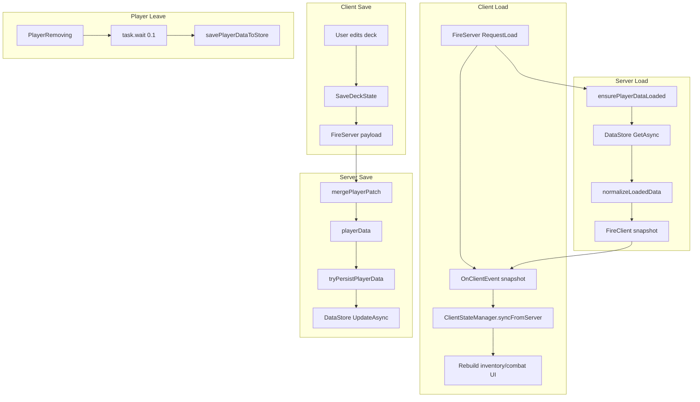
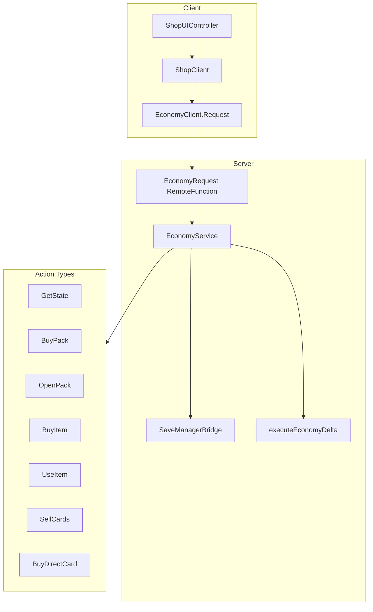
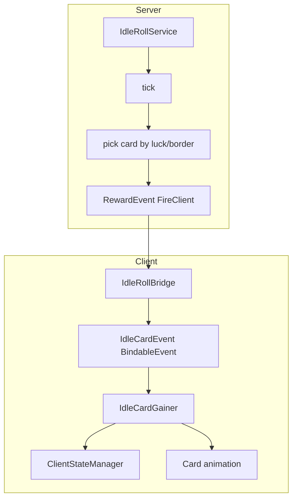
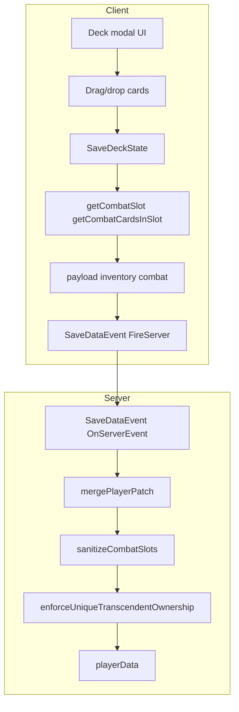
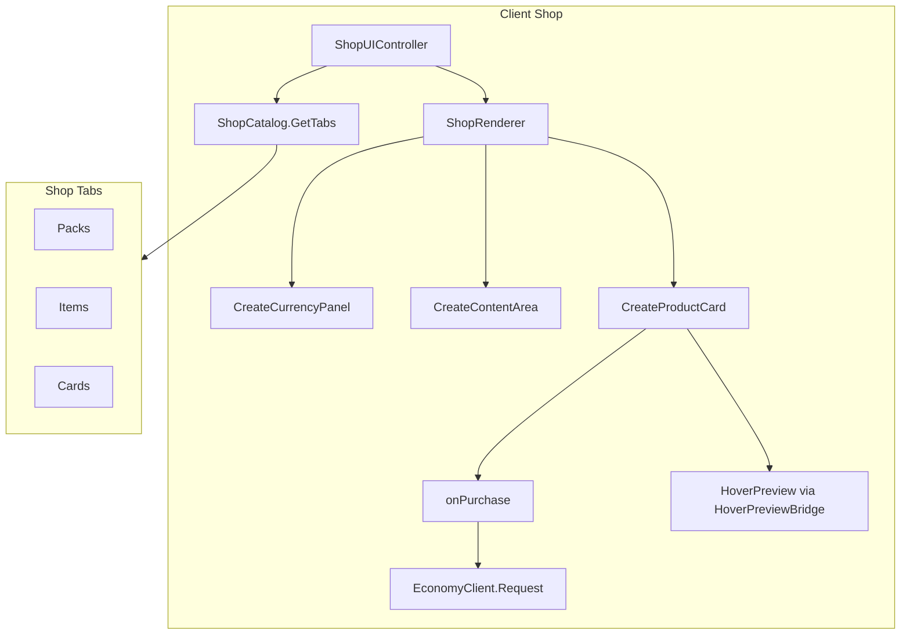
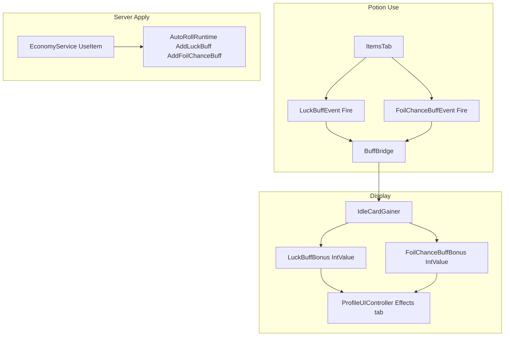
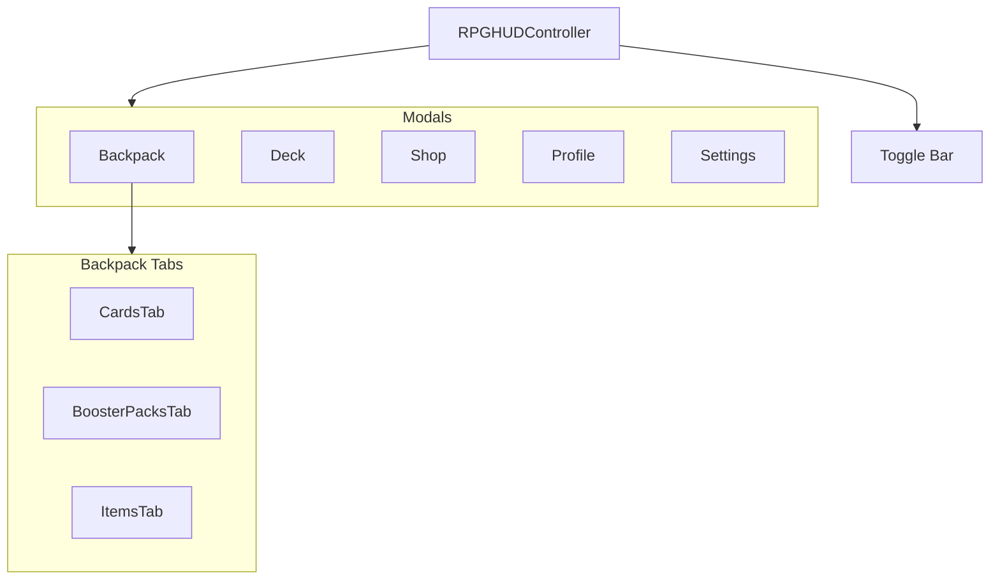

# Game Architecture — Flowcharts & Datasheet

Principal architect reference: module map, data flows, and visual diagrams for in-game logic.

**Related:** [SAVE_AND_PERFORMANCE_WORKFLOW.md](SAVE_AND_PERFORMANCE_WORKFLOW.md) — Master workflow for save fixes, performance tuning, and HoverPreview readability.

---

## 1. Module Directory

### src/client

| Module | Purpose |
|--------|---------|
| `core/ClientStateManager` | Client-side player state (level, rollCount, coins, stats, inventory, combatDeck, boosterPacks, items) |
| `core/BuffBridge` | Luck/FoilChance buff BindableEvents and IntValues |
| `IdleRollBridge.client` | Forwards RewardEvent → IdleCardEvent |
| `IdleCardGainer.client` | Handles IdleCardEvent, card gains, HUD buff timers, syncs to ClientStateManager |
| `InventoryController.client` | SaveDataEvent handler, deck/inventory UI, SaveDeckState |
| `services/EconomyClient` | EconomyRequest RemoteFunction calls |
| `services/ShopClient` | BuyItem, BuyDirectCard, UseItem, SellCards via EconomyClient |
| `shop/ShopCatalog` | Shop tabs (Packs, Items, Cards), EconomyCatalog entries |
| `shop/ShopRenderer` | Currency, tabs, product cards, border gallery |
| `shop/ShopUIController` | Shop modal setup, purchase handlers, HoverPreview |
| `tabs/TabController` | Backpack tab bar (Cards, Boosters, Items) |
| `tabs/CardsTab` | Cards tab |
| `tabs/BoosterPacksTab` | Boosters tab, open packs |
| `tabs/ItemsTab` | Items tab, potions via BuffBridge events |
| `ui/controllers/RPGHUDController` | Main HUD, toggle bar, modals (Backpack, Deck, Shop, Profile, Settings) |
| `ui/controllers/ProfileUIController` | Profile modal, stats, allocation, effects |
| `ui/controllers/SettingsUIController` | Settings modal (Audio, Graphics, Controls, Gameplay) |
| `ui/HoverPreview` | Shared card hover panel |
| `ui/ParallaxNameLabel` | Card name display helper |
| `ui/effects/HoloFoilController` | Foil overlays for bordered cards (Silver, Gold, Diamond, Cosmic, Corrupted) |
| `UIUtility.client` | Init: ClientStateManager, RPGHUDController, modal setup |
| `NpcBattleClient.client` | NPC battle UI |
| `PvpBattleClient.client` | PvP battle flow |

### src/server

| Module | Purpose |
|--------|---------|
| `SaveManager` | DataStore load/save, SaveDataEvent, mergePlayerPatch |
| `StatsHandler.server` | AllocatePointsRemote, StatsUpdatedEvent handler |
| `PlayerStatsService` | Stat allocation, reset, level-up via ServerStateManager |
| `EconomyService.server` | EconomyRequest handler (GetState, BuyPack, OpenPack, BuyItem, UseItem, SellCards, BuyDirectCard) |
| `IdleRollService.server` | Idle roll ticks, RewardEvent |
| `AutoRollRuntime` | Auto-roll timing per player |
| `NpcBattleService.server` | NPC battles |
| `PvpBattleService.server` | PvP battles |
| `core/ServerStateManager` | Facade for player state |
| `core/state/PlayerStateStore` | In-memory player state cache |
| `core/state/PlayerStateSchema` | Default state, sanitization, save payloads |
| `core/state/PlayerProgressionState` | coins, rollCount, level |
| `core/state/PlayerCollectionsState` | inventory, items, boosterPacks |
| `core/state/PlayerStatsState` | stats, allocation, level-up |
| `core/state/PlayerStateEvents` | StatsUpdatedEvent creation/firing |

### src/shared

| Module | Purpose |
|--------|---------|
| `EconomyProtocol` | EconomyRemotes folder, EconomyRequest, ActionType |
| `EconomyCatalog` | Item offers, direct card offers, sell values |
| `IdleRollProtocol` | RewardEvent, ControlEvent |
| `BattleProtocol` | NPC battle remotes |
| `PvpProtocol` | PvP remotes |
| `BalanceConfig` | ROLLS_PER_LEVEL, luck formulas, auto-roll interval |
| `CardDatabase` | Card data, rarity, combat power |
| `CardVisualResolver` | Card visuals from refs |
| `BoosterBalanceConfig` | Pack definitions |
| `BattleBalanceConfig` | Battle tuning |

---

## 2. Save/Load Flow



---

## 3. Economy Flow



---

## 4. Idle Roll Flow



---

## 5. Stats Allocation Flow


---

## 6. Combat Deck Flow



---

## 7. Shop Flow



---

## 8. Buff/Potion Flow



---

## 9. Modal/Tab Hierarchy



---

## 10. Data Schema Quick Reference

### PlayerState
```lua
{
    level = number,
    rollCount = number,
    coins = number,
    stats = { Luck, RollSpeed, PotionDuration, FoilChance, Points },
    inventory = { cardRef },
    combat = { cardRef | "" },
    boosterPacks = { [packId] = count },
    items = { [itemId] = count },
}
```

### EconomyProtocol.ActionType
- GetState, BuyPack, OpenPack, BuyItem, UseItem, SellCards, BuyDirectCard

### Remotes
| Name | Type | Owner |
|------|------|-------|
| SaveDataEvent | RemoteEvent | SaveManager |
| StatsUpdatedEvent | RemoteEvent | StatsHandler |
| AllocatePointsRemote | RemoteFunction | StatsHandler |
| EconomyRequest | RemoteFunction | EconomyService |
| RewardEvent | RemoteEvent | IdleRollService |
