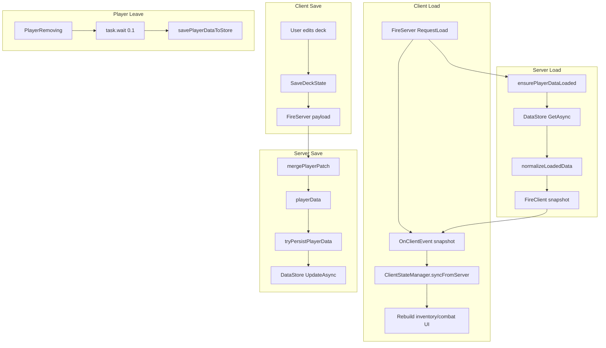
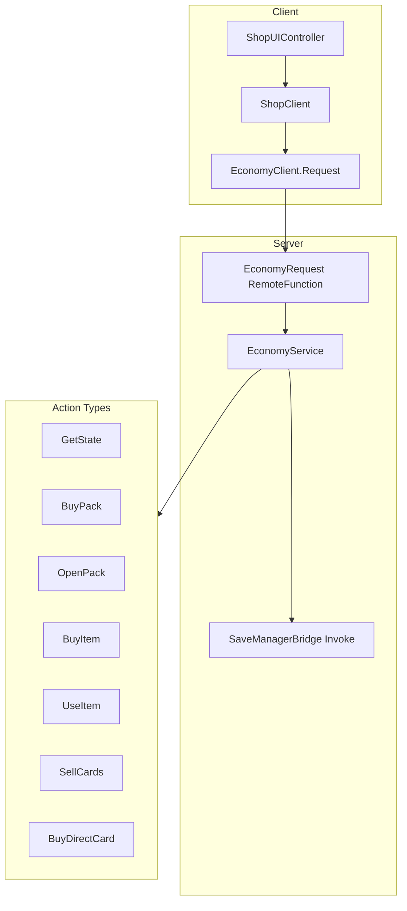
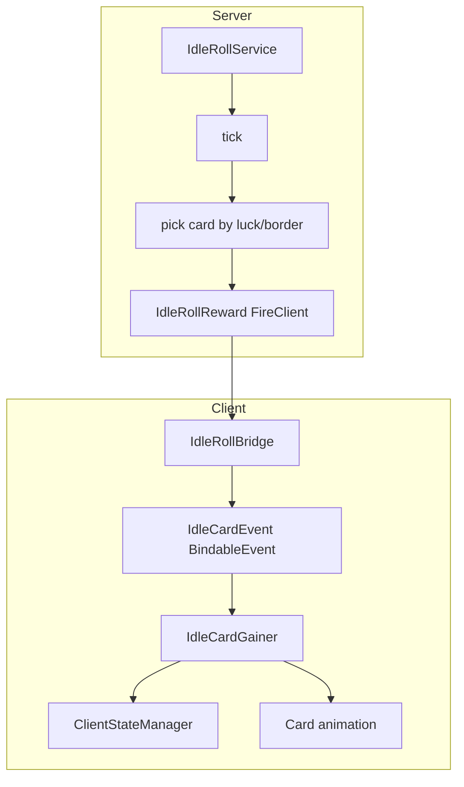
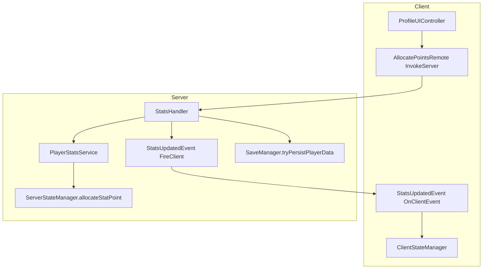
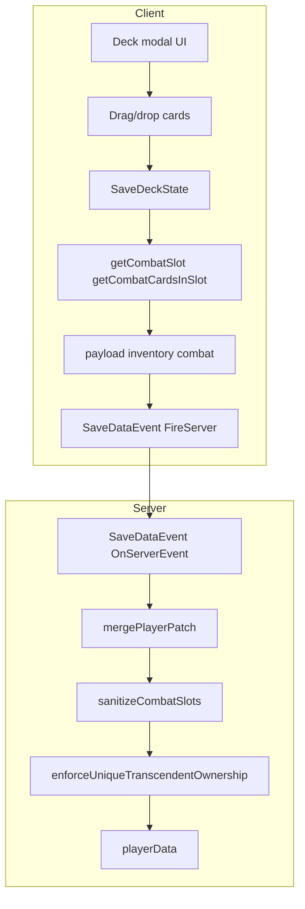
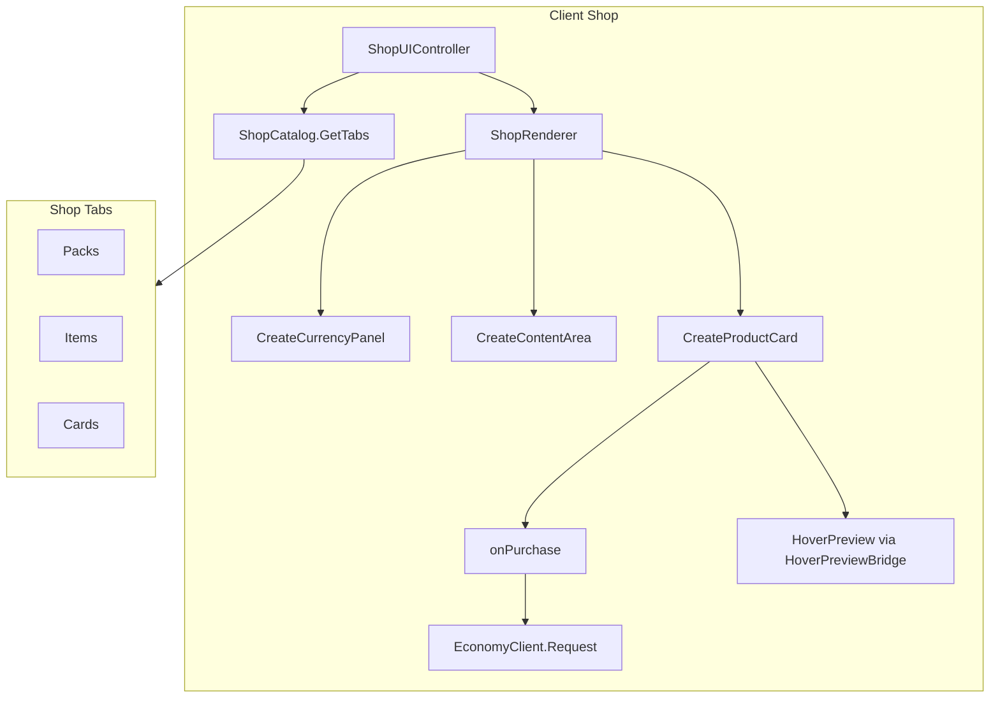
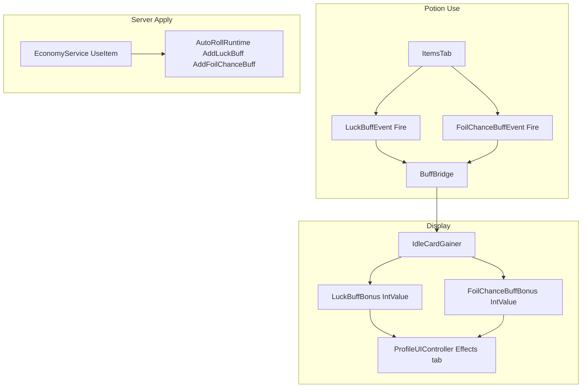
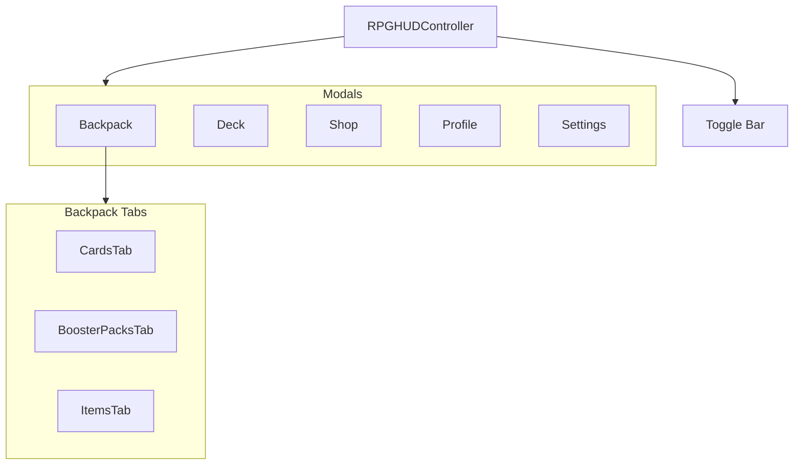

# Game Architecture — Flowcharts & Datasheet

Principal architect reference: module map, data flows, and visual diagrams for in-game logic.

**Related:** [SAVE_AND_PERFORMANCE_WORKFLOW.md](SAVE_AND_PERFORMANCE_WORKFLOW.md) — Master workflow for save fixes, performance tuning, and HoverPreview readability.

---

## 0. Rojo layout

Source of truth: [default.project.json](../default.project.json).

| Path | Roblox location |
|------|-----------------|
| `src/shared` | `ReplicatedStorage/Shared` |
| `src/server` | `ReplicatedStorage/Server` **and** `ServerScriptService/Server` (same tree mounted twice) |
| `src/client` | `StarterPlayer/StarterPlayerScripts/Client` |

---

## 1. Module Directory

### src/client

| Module | Purpose |
|--------|---------|
| `core/ClientStateManager` | Client-side player state (level, rollCount, coins, stats, inventory, combatDeck, boosterPacks, items) |
| `core/BuffBridge` | Luck/FoilChance buff BindableEvents and IntValues |
| `core/DeviceContext` | Mobile detection, safe insets, responsive UI constants |
| `IdleRollBridge.client` | Forwards `IdleRollRemotes/IdleRollReward` → `IdleCardEvent` (BindableEvent) |
| `IdleCardGainer.client` | IdleCardEvent, card gains, HUD buff timers, syncs to ClientStateManager |
| `InventoryController.client` | SaveDataEvent, deck/inventory UI, SaveDeckState, sell/bindable bridges, EconomySnapshotEvent handling |
| `BoosterPackSystem` | Owned boosters state, change events |
| `services/EconomyClient` | EconomyRequest calls; local `EconomySnapshotEvent` bindable for UI sync |
| `services/ShopClient` | BuyItem, BuyDirectCard, UseItem, SellCards via EconomyClient |
| `shop/ShopCatalog` | Shop tabs (Packs, Items, Cards), EconomyCatalog entries |
| `shop/ShopRenderer` | Currency, tabs, product cards, border gallery |
| `shop/ShopUIController` | Shop modal setup, purchase handlers |
| `tabs/TabController` | Backpack tab bar (Cards, Boosters, Items) |
| `tabs/CardsTab` | Cards tab |
| `tabs/BoosterPacksTab` | Boosters tab, open packs |
| `tabs/ItemsTab` | Items tab, potions via BuffBridge |
| `ui/controllers/RPGHUDController` | Main HUD, toggle bar, modals (Backpack, Deck, Shop, Profile, Settings) |
| `ui/controllers/ProfileUIController` | Profile modal, stats, allocation, effects |
| `ui/controllers/SettingsUIController` | Settings modal (Audio, Graphics, Controls, Gameplay) |
| `ui/controllers/ButtonStyler` | Shared button styling |
| `ui/controllers/FrameFactory` | Frame/card construction helpers |
| `ui/controllers/LayoutController` | Layout helpers |
| `ui/controllers/PreviewController` | Preview sub-UI |
| `ui/controllers/ToggleController` | Toggle control helpers |
| `ui/HoverPreview` | Shared card hover panel |
| `ui/HoverPreviewBridge` | Wires HoverPreview for shop/catalog surfaces |
| `ui/ParallaxNameLabel` | Card name display helper |
| `ui/BoosterOpenSequence` | Booster opening animation sequence |
| `ui/styles/StyleConfig` | Shared style tokens (includes `DamageNumbers` for combat popups) |
| `ui/DamageNumberView` | Config-driven floating damage numbers (PvE + PvP) |
| `ui/groups/DecksLayer` | Deck layer grouping |
| `ui/effects/HoloFoilController` | Foil overlays (Silver, Gold, Diamond, Cosmic, Corrupted) |
| `ui/effects/LightningOverlayController` | Lightning-style overlay for special cards |
| `ui/effects/RainbowBorderStroke` | Rainbow border stroke effect |
| `ui/effects/UltraRareTextEffect` | Ultra-rare title treatment |
| `vfx/VFXController` | Shared VFX hooks |
| `Spring` | Spring animation utility |
| `RarityConfig` | Client rarity styling |
| `BoosterBalanceConfig` | Client copy of pack defs (sync with shared where applicable) |
| `UIUtility.client` | Init: ClientStateManager, RPGHUDController, Profile/Inventory stub/Shop/Settings setup, EconomySnapshotEvent |
| `UIManager` | Deprecated stub (use UIUtility) |
| `InventoryUIController` | Minimal `Setup` stub; backpack built in InventoryController |
| `ShopUI` | Thin facade → `ShopUIController.Setup` |
| `NpcBattleClient.client` | NPC battle UI |
| `PvpBattleClient.client` | PvP battle flow |

### src/server

| Module | Purpose |
|--------|---------|
| `SaveManager` | DataStore load/save, SaveDataEvent, mergePlayerPatch, EconomySnapshotEvent on join |
| `StatsHandler.server` | Get-or-create AllocatePointsRemote + StatsUpdatedEvent; allocation invoke handler |
| `PlayerStatsService` | Stat allocation, reset, level-up via ServerStateManager |
| `EconomyService.server` | EconomyRequest handler (GetState, BuyPack, OpenPack, BuyItem, UseItem, SellCards, BuyDirectCard) |
| `IdleRollService.server` | Idle roll ticks; `IdleRollRemotes/IdleRollReward`, `IdleRollControl` |
| `AutoRollRuntime` | Auto-roll timing, luck/foil buff application |
| `NpcBattleService.server` | NPC battles (`BattleRemotes` per BattleProtocol) |
| `PvpBattleService.server` | PvP battles (`PvpRemotes` per PvpProtocol) |
| `SmokeChecks.server` | Startup validation (config, remotes; requires StatsHandler) |
| `ResetAllRolls.server` / `ResetRollsChatCommand.server` | Admin/reset roll tooling |
| `core/ServerStateManager` | Facade for player state |
| `core/state/PlayerStateConstants` | Defaults, allocatable-stat allowlists |
| `core/state/PlayerStateStore` | In-memory player state cache |
| `core/state/PlayerStateSchema` | Default state, sanitization, save payloads |
| `core/state/PlayerProgressionState` | coins, rollCount, level |
| `core/state/PlayerCollectionsState` | inventory, items, boosterPacks |
| `core/state/PlayerStatsState` | stats, allocation, level-up |
| `core/state/PlayerStateEvents` | StatsUpdatedEvent get-or-create + FireClient for state-layer sync |

### src/shared

| Module | Purpose |
|--------|---------|
| `EconomyProtocol` | EconomyRemotes folder, EconomyRequest, ActionType |
| `EconomyCatalog` | Item offers, direct card offers, sell values |
| `IdleRollProtocol` | IdleRollRemotes folder, IdleRollReward, IdleRollControl |
| `BattleProtocol` | NPC battle remotes and session/action enums (`EventType.NpcState` for PvE ticks) |
| `PvpProtocol` | PvP remotes and session/action enums |
| `BalanceConfig` | ROLLS_PER_LEVEL, luck formulas, auto-roll interval |
| `combat/CombatStatDefaults` | Default secondary combat stats + `MergeStatBlock` |
| `combat/CombatFormulas` | Effective attack/interval, `FilterAlive` |
| `combat/DamagePipeline` | Centralized damage/heal/PvE NPC HP application (`ApplyDamageToNpc`) |
| `combat/CombatAutoAbilities` | Data-driven auto abilities (shared by PvP + NPC) |
| `CardDatabase` | Card data, rarity, combat power; `GetCombatProfile`, `GetNpcCounterAttackIntervalSeconds`, `ResolveCardIdStrict` |
| `CardVisualResolver` | Card visuals from refs |
| `AbilityDatabase` | Canonical ability defs by Id (`Abilities`, `GetAbility`); cards set `AbilityId` on the row |
| `CardAbilityConfig` | Facade over `AbilityDatabase` for existing requires |
| `BoosterBalanceConfig` | Pack definitions |
| `BattleBalanceConfig` | Battle tuning |
| `Server` | Placeholder module under Shared (minimal) |

---

## 2. Save/Load Flow



---

## 3. Economy Flow



---

## 4. Idle Roll Flow



---

## 5. Stats Allocation Flow



---

## 6. Combat Deck Flow



---

## 7. Shop Flow



---

## 8. Buff/Potion Flow



---

## 9. Modal/Tab Hierarchy



---

## 10. Data Schema Quick Reference

### PlayerState
```lua
{
    level = number,
    rollCount = number,
    coins = number,
    stats = { Luck, RollSpeed, PotionDuration, FoilChance, Points },
    inventory = { cardRef },
    combat = { cardRef | "" },
    boosterPacks = { [packId] = count },
    items = { [itemId] = count },
}
```

### EconomyProtocol.ActionType
- GetState, BuyPack, OpenPack, BuyItem, UseItem, SellCards, BuyDirectCard

### Remotes (high level)

Named folders and remotes also live in `EconomyProtocol`, `IdleRollProtocol`, `BattleProtocol`, and `PvpProtocol`.

| Name | Type | Notes |
|------|------|-------|
| SaveDataEvent | RemoteEvent | SaveManager — full save snapshot |
| StatsUpdatedEvent | RemoteEvent | Get-or-create in `StatsHandler.server` and `PlayerStateEvents` (same instance name) |
| AllocatePointsRemote | RemoteFunction | StatsHandler |
| EconomyRequest | RemoteFunction | Under `EconomyRemotes`; EconomyService |
| EconomySnapshotEvent | RemoteEvent | SaveManager — join-time economy partial sync |
| IdleRollReward | RemoteEvent | Under `IdleRollRemotes`; IdleRollService |
| IdleRollControl | RemoteEvent | Under `IdleRollRemotes`; IdleRollService |
| BattleRemotes / PvpRemotes | RemoteEvents | NpcBattleService / PvpBattleService per shared protocols |
